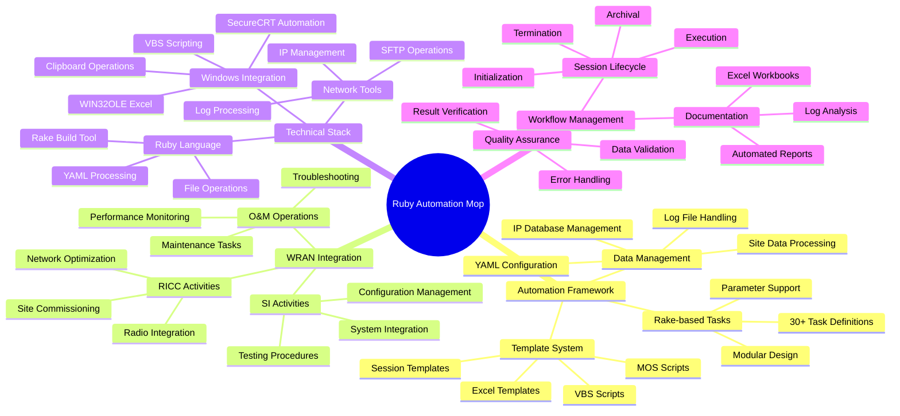

# **Project Automation Mop**

[Homepage](https://github.com/enogrob/ruby-automation-mop)


## Contents

- [Summary](#summary)
- [Architecture](#architecture)
  - [Alternative Perspectives](#alternative-perspectives)
  - [Key Concepts](#key-concepts)
- [Tech Stack](#tech-stack)
- [Getting Started](#getting-started)
- [Usage Examples](#usage-examples)
- [References](#references)

### Summary

The Ruby Automation Mop (RICC Automation) is a sophisticated Ruby-based automation framework developed by Roberto Nogueira for Ericsson between 2010-2013. This project was specifically designed to streamline and automate RICC (Radio Integration Competence Center), O&M (Operations & Maintenance), and SI (System Integration) activities in WRAN (Wireless Radio Access Network) Integration environments. The system serves as a comprehensive toolkit for telecommunications engineers working with Ericsson's wireless infrastructure.

The project centers around a powerful Rakefile containing over 2,600 lines of automation code that provides more than 30 distinct tasks for managing telecommunications network operations. These tasks range from generating Excel workbooks and managing site associations to processing logs, handling SFTP operations, and creating test templates. The automation framework significantly reduces manual effort in complex network integration processes, enabling engineers to execute standardized procedures with consistent results across multiple network sites.

The Ruby Automation Mop represents a critical tool for telecommunications professionals working in WRAN environments, particularly those involved in network rollouts, optimization, and maintenance activities. Its comprehensive approach to automation addresses the complex workflows typical in telecommunications infrastructure management, making it an invaluable resource for teams managing large-scale wireless network deployments and ongoing operations.

<br/>

<div align="center">
  <a href="https://www.youtube.com/playlist?list=PLFfgJOsnFX6uF2hE5OtbKPOoKOECyQmnx" target="_blank">
    
  </a>
</div>

<br/>

### Architecture


#### Alternative Perspectives

<details>
<summary><strong>1. Class Diagram - Structural Relationships</strong> (Click to expand)</summary>


</details>

<details>
<summary><strong>2. Journey Process - State Transitions</strong> (Click to expand)</summary>


</details>

<details>
<summary><strong>3. Mind Map - Interconnected Themes</strong> (Click to expand)</summary>



</details>

#### Key Concepts

* **RICC (Radio Integration Competence Center)**: The core domain focus of the automation framework, representing Ericsson's specialized unit responsible for wireless radio network integration and optimization activities
* **Rake Tasks**: The fundamental building blocks of the automation system, with each task representing a specific operation in the WRAN integration workflow, such as `ricc_init`, `ricc_scripts`, and `ricc_genxls`
* **TODAY Directory**: The active working directory where all current session files, data, and outputs are stored during automation execution, serving as the central workspace for ongoing activities
* **Template System**: A comprehensive collection of Excel, VBS, and MOS script templates that provide standardized starting points for various network integration activities and can be customized for specific sites
* **WIN32OLE Integration**: Ruby's interface to Windows COM objects, enabling direct manipulation of Excel workbooks and other Windows applications from within the automation scripts
* **Session Lifecycle**: The structured workflow from initialization (`ricc_start`) through execution to termination (`ricc_term`) and archival (`ricc_archive`), ensuring consistent project management
* **Site Data Processing**: The automation framework's ability to parse, validate, and manipulate telecommunications site information from various sources including logs, Excel files, and network management systems
* **Activity Types**: Different categories of network operations supported by the framework, including `fullip`, `rehoming`, `movistar`, and `dualstack`, each with specific templates and procedures
* **Log Processing**: Automated analysis and extraction of relevant information from network equipment logs, enabling data-driven decision making and report generation
* **SecureCRT Integration**: Automated terminal session management for connecting to network equipment, executing commands, and capturing outputs through VBS scripting

### Tech Stack

* **Programming Language**: Ruby 2.2.2p95 (2015-04-13 revision 50295) running on i386-cygwin platform
* **Build Tools**: Rake (10.4.2) as the primary task runner and automation orchestrator
* **Libraries/Dependencies**: 
  - YAML for configuration and data serialization
  - Rainbow for colorized terminal output and enhanced user experience
  - Find for file system traversal and search operations
  - WIN32OLE for Windows COM object integration (Excel automation)
  - Win32::Clipboard for Windows clipboard operations
* **Development Tools**: 
  - Cygwin environment for Unix-like functionality on Windows
  - SecureCRT for terminal session automation and network equipment access
* **Template Engine**: Custom template system supporting Excel (.xls), VBS scripts, and MOS scripts
* **Data Storage**: 
  - YAML files for session data persistence and configuration
  - Excel workbooks for structured data presentation and analysis
  - Text-based log files for operational data capture
* **Integration Platforms**: 
  - Windows COM objects for Office automation
  - SFTP for secure file transfer operations
  - Network management systems through command-line interfaces
* **Version Control**: Git for source code management and version tracking
* **Documentation**: Inline documentation within Rakefile and template-based report generation

### Getting Started

1. **System Requirements**:
   - Windows environment with Cygwin installed
   - Ruby 2.2.2 or compatible version
   - Microsoft Excel (for WIN32OLE integration)
   - SecureCRT (for terminal automation)

2. **Installation**:
   ```bash
   # Clone the repository
   git clone https://github.com/enogrob/ruby-automation-mop.git
   cd ruby-automation-mop
   
   # Install required Ruby gems
   gem install rake
   gem install rainbow
   gem install yaml
   ```

3. **Directory Setup**:
   ```bash
   # Create required directory structure
   mkdir -p /cygdrive/c/users/[username]/RICC/RICC_Templates
   mkdir -p /cygdrive/c/users/[username]/RICC/RICC_Archive
   mkdir -p /cygdrive/c/users/[username]/RICC/TODAY
   ```

4. **Configuration**:
   - Update the `RICC_PATH` variable in Rakefile to match your installation directory
   - Copy template files to the `RICC_Templates` directory
   - Ensure SecureCRT is installed and accessible

5. **Verification**:
   ```bash
   # Test the installation
   rake ricc_print
   ```

### Usage Examples

1. **Initialize a new RICC session**:
   ```bash
   # Initialize with default fullip activity
   rake ricc_init
   
   # Initialize with specific activity type
   rake ricc_init[rehoming]
   rake ricc_init[movistar]
   ```

2. **Start a RICC automation session**:
   ```bash
   # Begin session and create data file
   rake ricc_start
   ```

3. **Generate automation scripts for specific sites**:
   ```bash
   # Generate scripts for specific sites and activity
   rake ricc_scripts[SITE001,fullip,create]
   
   # Process multiple sites
   rake ricc_scripts["SITE001,SITE002,SITE003",rehoming,update]
   ```

4. **Create Excel workbooks for data analysis**:
   ```bash
   # Generate Excel workbooks for sites
   rake ricc_genxls[SITE001,fullip]
   
   # Generate for multiple activities
   rake ricc_genxls["SITE001,SITE002",dualstack]
   ```

5. **Process and analyze log files**:
   ```bash
   # Extract logs from RICC operations
   rake ricc_logsget
   
   # Generate command lists from logs
   rake ricc_cmdslist[SITE001]
   
   # Get detailed command analysis
   rake ricc_cmdslistd[SITE001]
   ```

6. **Complete session workflow**:
   ```bash
   # Initialize, start, process, and terminate
   rake ricc_init[fullip]
   rake ricc_start
   rake ricc_scripts[SITE001,fullip,create]
   rake ricc_genxls[SITE001,fullip]
   rake ricc_term
   ```

### References

* [Ruby Automation Mop Homepage](https://github.com/enogrob/ruby-automation-mop) - Official repository containing the complete automation framework and documentation
* [Ruby Documentation](https://ruby-doc.org/) - Official Ruby language documentation for understanding the programming foundation
* [Rake Documentation](https://ruby.github.io/rake/) - Comprehensive guide to the Rake build tool used as the automation orchestrator
* [WIN32OLE Documentation](https://docs.ruby-lang.org/en/2.7.0/WIN32OLE.html) - Ruby's Windows COM integration library for Excel automation
* [SecureCRT](https://www.vandyke.com/products/securecrt/) - Terminal emulation software used for network equipment access and automation
* [Ericsson WRAN Documentation](https://www.ericsson.com/) - Official Ericsson resources for Wireless Radio Access Network technologies and procedures
* [YAML Specification](https://yaml.org/) - Data serialization standard used for configuration and session data management
* [Rainbow Gem Documentation](https://github.com/sickill/rainbow) - Ruby library for colorized terminal output enhancement
* [KOs - YouTube Playlist](https://www.youtube.com/playlist?list=PLFfgJOsnFX6uF2hE5OtbKPOoKOECyQmnx) - In these videos are shown some automations while I was working at Ericsson (RICC) - Brazil

